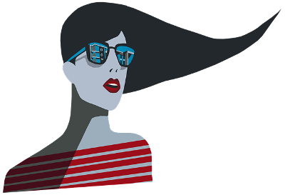

# Sam.scss

Scss Animated Microframework

## Overview

Sam is a microframework SCSS who group some important CSS properties by class.

Sam is oriented towards animation through the keyframes, the animation & the transform CSS properties.

Sam is provided without any JavaScript code line...

Sam can make a grid with flexbox layout or with grid layout!

Sam can be used without any SCSS, Sass or Ruby knowledge, by using only the CSS library.

Sam is build around 6 main characteristics :
-   the display, the colors, the borders, the shadows, the animations & the helpers.  

Sam provides 3 basic elements in more, the navigation bar, buttons & forms.

## Summary

-   [Package Manager](#package-manager)  
-   [CDN](#cdn)  
-   [Download](#download)  
-   [Content](#content)  
-   [Language](#language)  
-   [Support](#support)  
-   [Open-Source](#open-source)  
-   [Documentation](#documentation)  
-   [Issues](#issues)  
-   [Pull Requests](#pull-requests)  
-   [Contributing](#contributing)  
-   [Versioning](#versioning)  
-   [Creator](#creator)  
-   [Copyright](#copyright)  

---

## Package Manager

NPM : `npm i sam.scss`  
Yarn : `yarn add sam.scss`    

---

## CDN

For dev :
[https://cdn.jsdelivr.net/npm/sam.scss@0.2.5/dist/sam.css](https://cdn.jsdelivr.net/npm/sam.scss@0.2.5/dist/sam.css)

For prod :
[https://cdn.jsdelivr.net/npm/sam.scss@0.2.5/dist/sam.min.css](https://cdn.jsdelivr.net/npm/sam.scss@0.2.5/dist/sam.min.css)

---

## Download

[Latest Release](https://github.com/philippebeck/sam.scss/releases)  

`git clone https://github.com/philippebeck/sam.scss.git`  
  

---

## Content

The project contains 2 folders :  
-   dist = the distribution library : `sam.scss` - `sam.min.scss`  
-   scss = the source code of the project : `functions` - `init` - `main` - `mixins` - `variables`  

---

## Language

Sam is wrote only with SCSS & compile to CSS

---

## Support

Sam has NO continuous support !

---

## Open-Source

---

## Documentation

Documentation is available !

---

## Issues

Issues can be created here

---

## Pull Requests

And Pull Requests can be created there

---

## Contributing

Sam needs you if you like it : sends pull requests on GitHub to improve it !!

---

## Versioning

Sam is maintained under the [Semantic Versioning 2.0.0](https://semver.org)

---

## Creator

Philippe Beck

---

## Copyright

Code released under the MIT License

---

## Support on Beerpay

Hey dude! Help me out for a couple of :beers:!

